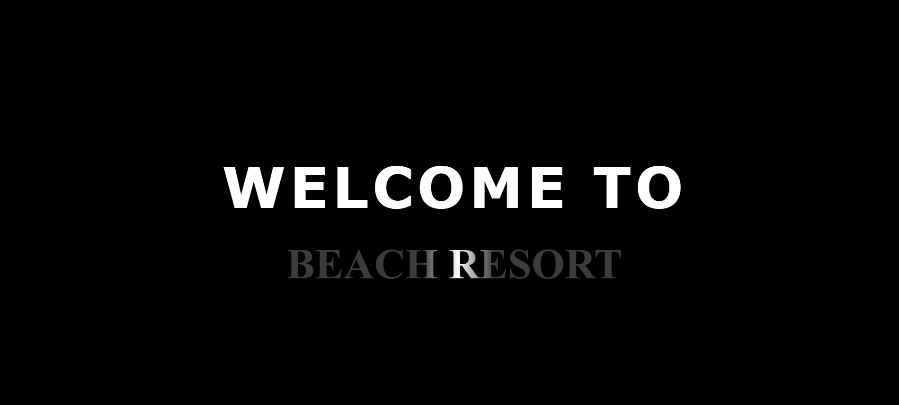
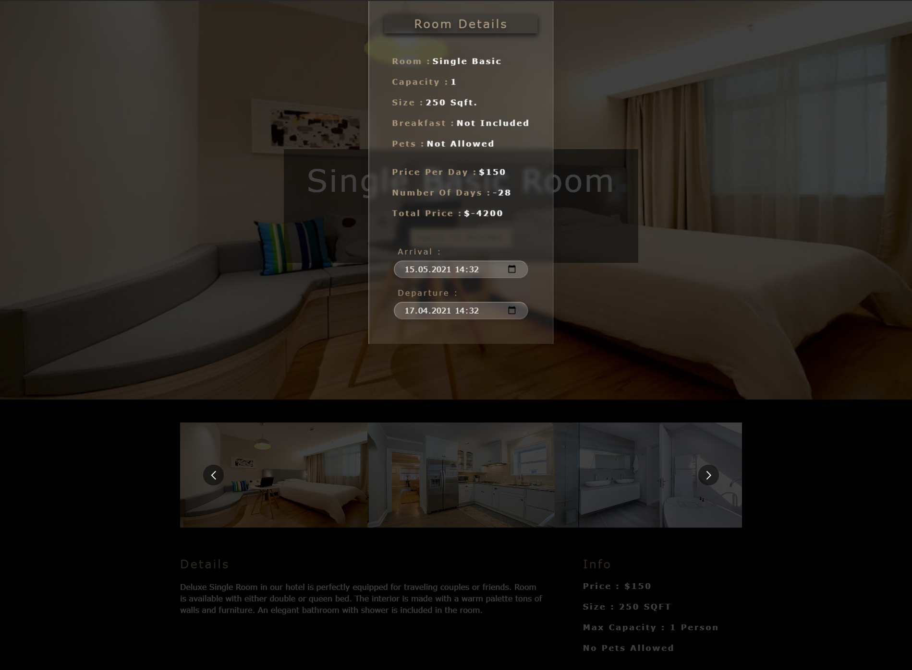
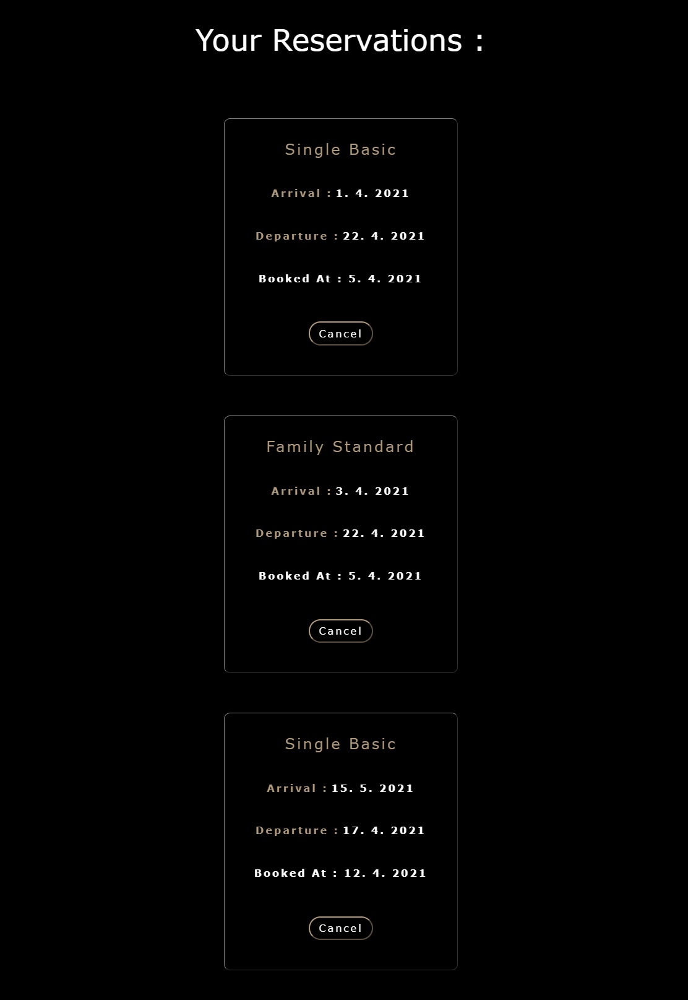

# This is a demonstration of the hotel website with the room reservation feature.

### Type : Full-stack

### Build with :
* React
* Bootstrap
* styled-components
* Node.js
* Express
* Graphql
* MongoDB

### 1. Smooth scrolling, component's reveal on scroll and custom carousels for better UI/UX experience.

### 2. Opportunity of booking a room for a selected number of days with information about the price and parameters of the room.

### 3. User profile showing all bookings with the possibility of cancellation.

# Getting Started with Create React App

This project was bootstrapped with [Create React App](https://github.com/facebook/create-react-app).

## Available Scripts

In the project directory, you can run:

### `npm start`

Runs the app in the development mode.\
Open [http://localhost:3000](http://localhost:3000) to view it in the browser.

The page will reload if you make edits.\
You will also see any lint errors in the console.

### `npm run build`

Builds the app for production to the `build` folder.\
It correctly bundles React in production mode and optimizes the build for the best performance.

The build is minified and the filenames include the hashes.\
Your app is ready to be deployed!

See the section about [deployment](https://facebook.github.io/create-react-app/docs/deployment) for more information.
